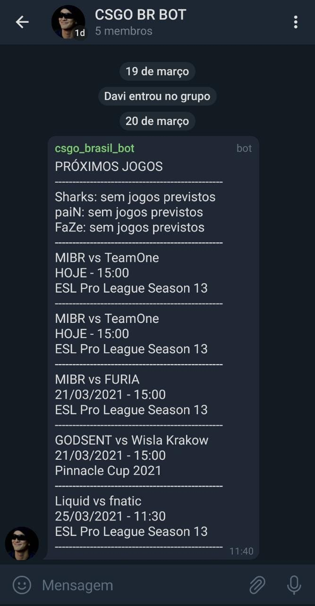

# CSGO BR BOT

> Bot para telegram que envia para o grupo <a href="https://t.me/csgobrbot" target="_blank">https://t.me/csgobrbot</a> uma lista de jogos dos times brasileiros que jogam fora do brasil.
> Lista de times: MIBR, FURIA, paiN, Liquid, GODSENT, TeamOne, FaZe, Sharks.

## 🚀 Instalando CS:GO BRASIL BOT

Para instalar o Pokedex, siga estas etapas:

1. Abra o terminal do seu computador no local em que deseja colocar o projeto.
2. Faça um clone desse repositório rodando:   `git clone https://github.com/oscarkemuel/csgo-br-bot.git`;
3. Entre na pasta rodando: `cd csgo-br-bot`;
4. Rode `yarn` ou `npm install` para instalar as dependências do projeto;
5. Crie um arquivo na raiz do projeto chamado de .env com as variáveis de ambiente `APP_TOKEN` e `CHAT_ID`, de acordo com a api do telegram;
6. Rode `yarn dev` ou `npm dev` para iniciar o servidor de desenvolvimento.

## :computer: Dependências

* axios
* cors
* dotenv
* express
* telegraf

## 📫 Contribuindo para CSGO BR BOT
Para contribuir com Pokedex, siga estas etapas:

1. Bifurque este repositório.
2. Crie um branch: `git checkout -b <nome_branch>`.
3. Faça suas alterações e confirme-as: `git commit -m '<mensagem_commit>'`
4. Envie para o branch original: `git push origin <nome_do_projeto> / <local>`
5. Crie a solicitação de pull.

## 📫 Contribuidores 

<table>
  <tr>
    <td align="center">
      <a href="https://github.com/oscarkemuel/">
         
        
          <b>Oscar Kemuel</b>
        
      </a>
    </td>
  </tr>
</table>
